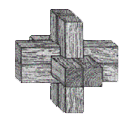

# Holzabbund Wädenswil AG

**My granddads Timber joinery since 1987 – Precision timber processing from Wädenswil, Switzerland**



---

## About the Project

This is not yet the official website for **Holzabbund Wädenswil AG**. The company offers professional timber joinery (Abbundarbeiten), planning, wood product sales, and supporting services in the Wädenswil, Hirzel, Albis, and surrounding regions. The website is built with [Next.js](https://nextjs.org) and presents the company’s services, team, location, and contact information.

---

## Features

- **Homepage** with concise information and slideshow
- **Navigation**: Clear menus for Timber Joinery, Sales, Planning, About Us (including Suppliers & Open Positions), Location, and Contact
- **Contact and Location page** with address, phone number, and additional contact data
- **Modern, responsive design** using [Tailwind CSS](https://tailwindcss.com) and component libraries like [DaisyUI](https://daisyui.com)
- **Optimized fonts** via [`next/font`](https://nextjs.org/docs/app/building-your-application/optimizing/fonts), [Geist](https://vercel.com/font) and [Inter](https://fonts.google.com/specimen/Inter)
- **Easy extensibility** for new content such as products and services

---

## Getting Started

To run the project locally, follow these steps:

```bash
npm install
npm run dev
# or with yarn
yarn install
yarn dev
# or with pnpm
pnpm install
pnpm dev
# or with bun
bun install
bun dev
```

Afterwards, the site will be available at [http://localhost:3000](http://localhost:3000).

---

## Project Structure

```
holzabbund/
├── public/
│   └── img/               # Images, e.g. logo
├── src/
│   ├── app/
│   │   ├── components/    # Reusable components like Navbar & Footer
│   │   ├── page.tsx       # Home page
│   │   └── globals.css    # Global CSS definitions
│   └── ...
├── .eslintrc, .prettierrc # Linting & code formatting configs
├── README.md
└── ...
```

---

## Key Pages & Navigation

- **Home:** Overview and slideshow
- **Timber Joinery:** Services around joinery and timber processing
- **Sales:** Wood products for sale
- **Planning:** Support for planning and execution
- **About Us:** Team info, suppliers, open positions
- **Location:** Address, directions
- **Contact:** Contact form, phone, email

---

## Contact

**Holzabbund Wädenswil AG**  
Aamühle 9  
8820 Wädenswil  
Tel. +41 44 683 21 65  
Fax +41 44 683 21 69

---

## Deploy on Vercel

The easiest way to deploy your Next.js app is via the [Vercel Platform](https://vercel.com/new?utm_medium=default-template&filter=next.js&utm_source=create-next-app&utm_campaign=create-next-app-readme). For more details, see the [Next.js deployment documentation](https://nextjs.org/docs/app/building-your-application/deploying).

---

## Learn More

- [Next.js Documentation](https://nextjs.org/docs) – Features and API
- [Learn Next.js](https://nextjs.org/learn) – Interactive tutorial
- [Next.js GitHub repository](https://github.com/vercel/next.js)

---

## License

MIT

---

© Calvin 2025
